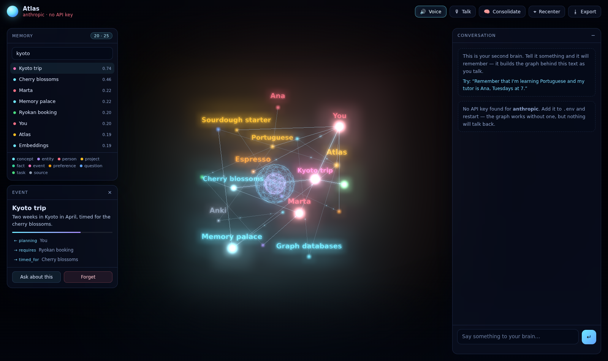

# Second Brain — a 3D knowledge graph that talks back

An animated 3D knowledge graph with persistent memory, driven by your **Claude** or **ChatGPT** account. You talk to it; it decides what's worth remembering, files it as nodes and edges, and speaks its answers out loud while the camera flies to whatever it's referring to.

It isn't a chatbot with a graph stuck next to it. The model owns the graph — every memory you see was created by a tool call it chose to make.



---

## Quick start

```bash
git clone <this repo> && cd Knowledge.graph
npm install
cp .env.example .env        # add ONE api key (see below)
npm run seed                # optional: a small demo graph so it isn't empty
npm run dev                 # → http://localhost:5173
```

For a single-process production build:

```bash
npm run serve               # builds the UI, serves everything → http://localhost:8787
```

Tests need no API key and no network:

```bash
npm test
```

### Already pay for Claude Max or ChatGPT Plus?

Use those instead of buying API credits — **[docs/SUBSCRIPTIONS.md](docs/SUBSCRIPTIONS.md)**.

Neither subscription includes API access; those are separately-billed products. But
both Claude and ChatGPT speak MCP, so the model can call *this* app rather than the
other way round:

```bash
npm run serve                     # keep running
claude mcp add second-brain -- node "$PWD/mcp/server.js"     # Claude Max
npm run mcp:http                  # ChatGPT connector URL (needs a tunnel)
```

Your subscription does the thinking, the graph does the remembering, and the 3D view
animates live as memories are written from either app.

To keep *this* app's own interface — 3D **and** voice — on your Max plan, run
`claude` once to sign in and set `BRAIN_PROVIDER=claude-code`.

### Or use API keys

| Key | What you get |
|---|---|
| `ANTHROPIC_API_KEY` | Claude as the brain. The better one for this — it reasons harder about what's worth linking. |
| `OPENAI_API_KEY` | ChatGPT as the brain. Also unlocks real embeddings and a much better voice. |

Set both and you get the best of both: Claude thinks, OpenAI supplies embeddings and the voice. Switch any time with `BRAIN_PROVIDER=anthropic|openai|claude-code`.

With **no key and no subscription route** the graph, search, and 3D view still work — nothing will talk back.

---

## What it does

**Remembers without being asked.** Tell it something durable and it files it. "Ana is my Portuguese tutor, Tuesdays at 7" becomes a `person` node, a `project` node, an edge labelled `teaches`, and a time detail — not one blob of text.

**Recalls before it answers.** Every message triggers an automatic hybrid search; the model can also search again mid-answer. It's told, firmly, not to guess when the answer is stored.

**Links things.** New memories are connected to what's already there. Unconnected nodes are close to useless, so the system prompt pushes hard on this.

**Shows you what it means.** When the answer centres on particular memories, the model calls `focus_view` and the camera flies to them while it speaks.

**Speaks.** Answers stream out sentence by sentence as they're generated, so it starts talking before it's finished thinking. The core at the centre of the graph pulses to the actual audio amplitude.

**Listens.** Push-to-talk via the browser's speech recogniser (Chrome/Edge).

---

## How memory works

Everything lives in one JSON file (`data/brain.json`) — greppable, diffable, and easy to back up. No database to run, no native modules to compile.

```
node  { id, label, type, summary, content, tags[], importance,
        createdAt, lastAccessedAt, accessCount, pinned, archived, embedding }
edge  { id, from, to, rel, weight }
```

**Recall is hybrid**, because no single signal is trustworthy on its own — vectors miss exact names, keywords miss paraphrase, and recency alone is just a timeline:

```
score = 0.45·cosine + 0.35·BM25 + 0.10·recency + 0.10·importance
```

…then one hop of graph expansion, so a strong hit drags its neighbours along with it.

Memories that get recalled drift *up* in importance; everything decays gently by recency (~30-day half-life). Forgetting archives by default rather than deleting, so it stays recoverable and still shows up in your export.

### The model's tools

| Tool | What it does |
|---|---|
| `recall_memory` | Hybrid search over everything |
| `remember` | Create nodes + edges in one call; same-label nodes merge instead of duplicating |
| `link_nodes` | Connect two existing memories |
| `update_node` | Revise a memory that changed or was wrong |
| `forget` | Archive (or, if you confirm, delete) |
| `get_neighbors` | Walk outward 1–3 hops |
| `focus_view` | Fly the camera and light nodes up |
| `graph_stats` | Counts and type breakdown |

---

## The 3D view

- **Force-directed layout**, hand-rolled so the physics shares a clock with the visuals — the graph reheats when memory changes and nodes spawn next to the neighbours they link to instead of flying in from nowhere.
- **Colour by type**, size by importance and degree.
- **Signal pulses** run the edges; they speed up and multiply while the brain is thinking.
- **Labels declutter themselves** in screen space and hold a constant on-screen size at any zoom.
- Click a node to inspect it and fly to it. `/` search, `V` mute, `R` recenter, `Space` push-to-talk, `Esc` shut it up.

Node size, camera framing, and label scale are all derived from the graph's actual extent, so it looks right with 20 memories or 2,000.

---

## Configuration

All optional except the key. See `.env.example`.

| Variable | Default | Notes |
|---|---|---|
| `BRAIN_PROVIDER` | auto | `anthropic`, `openai`, or `claude-code` (Max subscription); auto-picks whichever key exists |
| `CLAUDE_CODE_MODEL` / `_EFFORT` / `_MAX_TURNS` | — | Subscription route only; empty inherits Claude Code's own settings |
| `ANTHROPIC_MODEL` | `claude-opus-5` | Any current model id |
| `ANTHROPIC_EFFORT` | `high` | `low`…`max`. How hard it thinks per turn |
| `OPENAI_MODEL` | `gpt-4o` | Any chat model your account can reach |
| `OPENAI_EMBED_MODEL` | `text-embedding-3-small` | |
| `OPENAI_TTS_VOICE` | `alloy` | |
| `BRAIN_NAME` | `Atlas` | It answers to this |
| `DATA_DIR` | `./data` | Where memory lives |
| `PORT` | `8787` | |
| `ANTHROPIC_BASE_URL` / `OPENAI_BASE_URL` | — | Point at a proxy, gateway, or local model server |
| `BRAIN_APP_URL` | `http://127.0.0.1:8787` | Where the MCP server finds this app |
| `MCP_PORT` | `8788` | Port for the HTTP transport ChatGPT connectors need |

### API

`GET /api/health` · `GET /api/graph` · `GET /api/search?q=` · `GET /api/node/:id`
`GET /api/events` (SSE — live graph changes from any source) · `POST /api/mcp/tool`
`POST /api/chat` (SSE) · `POST /api/consolidate` (SSE) · `POST /api/tts`
`POST /api/node` · `PATCH /api/node/:id` · `DELETE /api/node/:id` · `POST /api/link`
`GET /api/export` · `POST /api/import`

`/api/chat` streams Server-Sent Events over POST: `start`, `recall`, `thinking`, `text`, `tool_call`, `tool_result`, `focus`, `graph_delta`, `done`, `error`.

---

## Things worth knowing before you rely on it

**Without an OpenAI key, semantic recall is weak.** The offline fallback is a hashed character-trigram vector — deterministic and free, but not semantic. It handles "portuguese tutor" → *Ana* fine, and misses "what do I drink in the morning" → *Espresso* entirely, because there's no shared vocabulary to latch onto. Lexical BM25 carries most of the weight in that mode. Add an OpenAI key and this problem goes away; existing memories are re-embedded automatically on next start.

**Speech recognition is Chrome/Edge only.** The Web Speech API isn't implemented in Firefox and is unreliable in Safari. Text input works everywhere; speech *output* works in any modern browser.

**Browser voices vary a lot.** Without an OpenAI key you get whatever the OS provides, which on some Linux setups is fairly robotic. With a key, `/api/tts` is used instead and the audio amplitude genuinely drives the animation, rather than being approximated from word-boundary events.

**There is no authentication.** It's built to run on your own machine, and `data/brain.json` is plain text. Don't expose the port to a network you don't trust, and don't tell it secrets you wouldn't write in a text file.

**The transcript is bounded, the graph is not.** Only the last 24 turns are replayed as conversation history — long-term memory is the graph, which is the whole point. If something matters, it needs to be a node; hit **Consolidate** to sweep the recent transcript for anything the model forgot to file.

**Cost.** Every turn sends the system prompt, ~24 turns of history, and 8 tool schemas. The Claude path marks the system prompt for caching, which takes most of the sting out of a long session. Drop `ANTHROPIC_EFFORT` to `medium` or `low` if you're chatting casually rather than thinking hard.

---

## Tests

`npm test` runs 22 tests against mock Anthropic and OpenAI servers that speak
the real streaming wire formats — no API key, no network, ~3 seconds.

The interesting coverage is the tool loop: tool-call JSON arrives split
mid-token and has to be reassembled, results fed back, and the loop run to a
second round. The suite asserts on the exact request shape we send Anthropic
(adaptive thinking, `effort`, cached system prompt, no sampling params, tool
results batched into one user message, thinking blocks echoed back unmodified),
since getting any of those wrong is a 400 in production but invisible locally.

Three of the tests are regression guards for bugs found while building this,
and each was mutation-tested — the bug reintroduced, the suite confirmed to
fail on exactly that test, then reverted:

| Guard | The bug it catches |
|---|---|
| `concurrent saves share one promise` | `save()` minted a promise per call and cleared the prior timer, orphaning the earlier promise so an awaited save hung forever |
| `a failed turn leaves no orphan user message` | the user turn was persisted before the provider call, so a failed request left a dangling message replayed as history forever |
| `request shape matches the API contract` | sending `temperature`, which 400s on Opus 5 |

## Layout

```
server/
  index.js            Express + SSE endpoints
  brain.js            System prompt, auto-recall, turn orchestration
  memory.js           Hybrid search, remember/merge, context building
  store.js            JSON-backed graph store, atomic writes
  embeddings.js       OpenAI embeddings + offline fallback
  tools.js            Tool schemas, provider adapters, dispatch
  events.js           Broadcast bus for live viewers
  providers/
    anthropic.js      Streaming tool loop (adaptive thinking, prompt caching)
    openai.js         Streaming tool loop + TTS
    claude-code.js    Runs on a Claude Pro/Max subscription via the Agent SDK
web/src/
  graph3d.js          Force layout, shaders, bloom, camera, labels
  voice.js            Speech out (streamed, sentence-chunked) and in
  main.js             UI wiring, SSE consumption
  api.js              Fetch helpers + SSE-over-POST parser
mcp/server.js         MCP server (stdio + HTTP) for Claude Desktop / ChatGPT
scripts/seed.js       Demo graph
test/
  mocks.js            Scriptable Anthropic/OpenAI streaming mocks
  brain.test.js       Store, memory, tools, and both provider loops
  mcp.test.js         MCP server driven over real JSON-RPC
```

---

## License

MIT.
